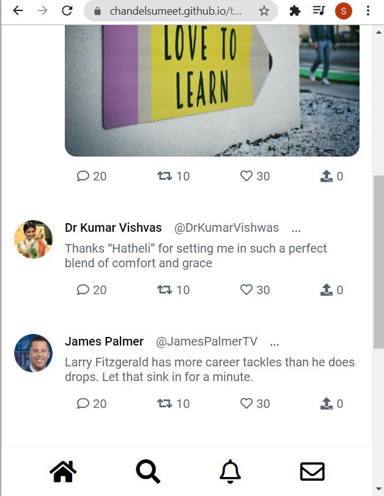

# Twitter Ui

## Introduction

In process of learning frontend development, I have created this twitter ui to get hands on learning experience.

### In process of developing this project, i learned following things

*   Design first approach
*   HTML 5 semantic tags
*   CSS3 properties, media queries
*   Responsive layouts with flex and grid

Desktop Screen

Mobile Screen

## Built With

Technologies Used

*   [HTML5](https://www.w3schools.com/html/)
*   [CSS3](https://www.w3schools.com/css/)

## Contact

Name : Sumeet Chandel

Mail : sumeetchandel321@gmail.com

Project Link : [https://chandelsumeet.github.io/twitter-ui-res/](https://chandelsumeet.github.io/twitter-ui-res/)

## Acknowledgement

*   [w3schools](https://www.w3schools.com/)
*   [CSS tricks](https://css-tricks.com/)
*   [Flex Box](https://developer.mozilla.org/en-US/docs/Web/CSS/CSS_Flexible_Box_Layout/Basic_Concepts_of_Flexbox)
*   [CSS Grid](https://css-tricks.com/snippets/css/complete-guide-grid/)
